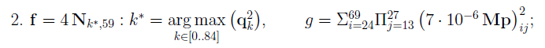
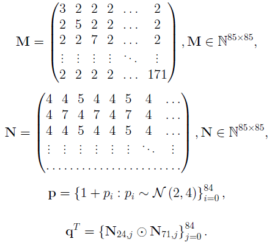
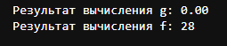

# Лабораторная 4 по дисциплине "Технологии программирования"

---

Цели работы:

1. Познакомиться c библиотеками Python NumPy, Pandas и Matplotlib.
2. Разобраться с принципами работы в среде Jupyter Notebook на основе сервиса Google Colab.
3. Получить навыки выполнения векторных вычислений с использованием библиотеки NumPy.
4. Получить навыки анализа, обработки и визуализации датасетов с применением библиотек Pandas и Matplotlib.

---

### Работа с NumPy

В качестве работы с NumPy и  Python в среде Jupyter Notebook был выполнен математический просет следующих формул. 

  
  
 Рисунок 1 – Два прмиера для решения 
 

Со следующими критериями и дополнительной информацией.

  
  
 Рисунок 2 – Пояснение к примерам 
 

В результате вы можете перейти в файл [lab4_TPR_NumPy_Tasks](https://github.com/QuanRy/TPR_L4/blob/main/lab4_TPR_NumPy_Tasks.ipynb) и просмотреть результат, а также сам ход вычислений. Или же просмотреть рисунок 3.

  
  
 Рисунок 3 – Результат работы с NumPy 
 

---

### Работа с визуализацией и анализом датасета.

Для изучения визуализации будем испоьзовать базовый и достаточно уже приевшийся всем датасет 
