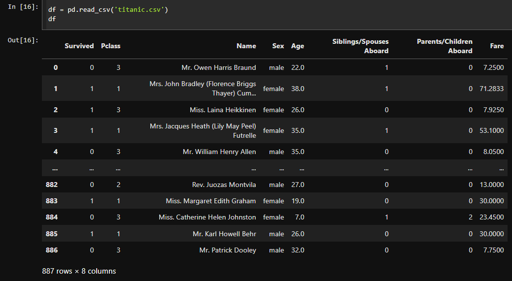
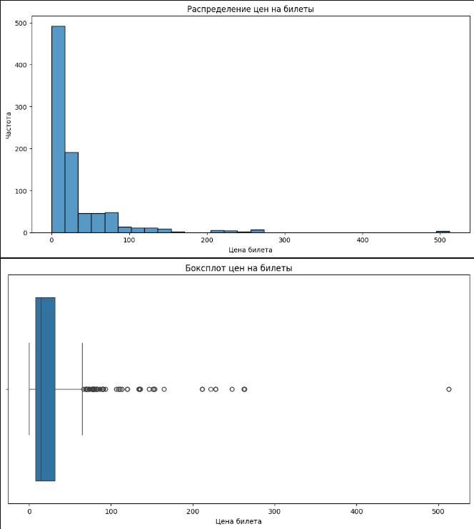

# Лабораторная 4 по дисциплине "Технологии программирования"

---

Цели работы:

1. Познакомиться c библиотеками Python NumPy, Pandas и Matplotlib.
2. Разобраться с принципами работы в среде Jupyter Notebook на основе сервиса Google Colab.
3. Получить навыки выполнения векторных вычислений с использованием библиотеки NumPy.
4. Получить навыки анализа, обработки и визуализации датасетов с применением библиотек Pandas и Matplotlib.

---

### Работа с NumPy

В качестве работы с NumPy и  Python в среде Jupyter Notebook был выполнен математический просет следующих формул. 

  
  
 Рисунок 1 – Два прмиера для решения 
 

Со следующими критериями и дополнительной информацией.

  
  
 Рисунок 2 – Пояснение к примерам 
 

В результате вы можете перейти в файл [lab4_TPR_NumPy_Tasks](https://github.com/QuanRy/TPR_L4/blob/main/lab4_TPR_NumPy_Tasks.ipynb) и просмотреть результат, а также сам ход вычислений. Или же просмотреть рисунок 3.

  
  
 Рисунок 3 – Результат работы с NumPy 
 

---

### Работа с визуализацией и анализом датасета.

Для изучения визуализации будем испоьзовать базовый и достаточно уже приевшийся всем [датасет](https://web.stanford.edu/class/archive/cs/cs109/cs109.1166/stuff/titanic.csv) "ТИТАНИК", взятый с сайта университета [Стэнфорд](https://www.stanford.edu/). Данный датасет хорошо подходит для изучения основ ML и знакомства с обработкой  визуализацией данных. Таблица данных, содержащихся в датасете представлена на рисунке 4.

  
  
 Рисунок 4 – Датасет Титаник 
 

Ну и далее приведем примеры визуализаций представленных в файле [lab4_TPR_Pandas_Tasks](https://github.com/QuanRy/TPR_L4/blob/main/lab4_TPR_Pandas_Tasks.ipynb).

  
  
 Рисунок 5 – Диаграмма рассеивания 
 

  
  
 Рисунок 6 – Boxplot и диаграмма анализа цен билета 
 

  
  
 Рисунок 7 – График выживших, исходя из пола (Pie) 
 

  
  
 Рисунок 8 – График выживших, исходя из пола (Гистограмма) 
 

На основании проведенного исследования, можно заключить следующий вывод

  
  
 Рисунок 9 – Результат анализа выживаемости по полу 
 

Ну, еще пару графиков анализа данных датасета

  
  
 Рисунок 10 – График распределения пола, возраста для 1-2 класса 
 

  
  
 Рисунок 11 – График распределения пола, возраста для 3 класса 
 

